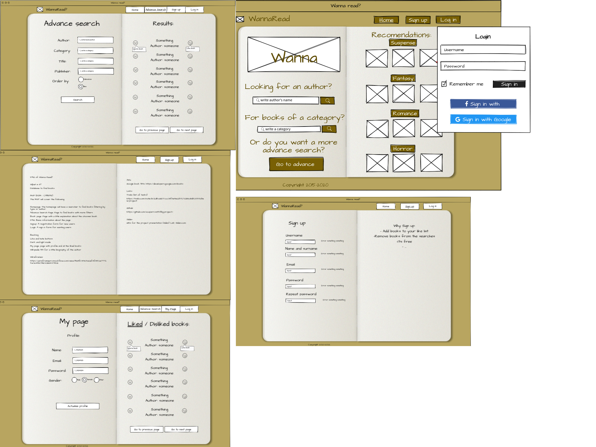

# Project's name
WannaRead?

## Description
WannaRead? is a webpage that uses the google books Api to make a database of books. So you can search and save books.

## Pages

    Homepage: The homepage will have a searcher to find books filtering by type or author.
    Advance Search Page: Page to find books with more filters
    Book page: Page with a little explanation about the choosen book.
    FAQ: Basic information about the page.
    Signup: A registration form for new users.
    Login: A sign in form for existing users.

## Backlog    
Add more filters
Wikipedia API for a little biography of the author
Goodreads API to get reviews

## Wireframes    

## APIs
Google book APIs: https://developers.google.com/books

### Github
URls for the project repo and deploy
[Link Repo](https://github.com/xcaparros89/Big-project-1)
[Link Deploy](https://xcaparros89.github.io/Big-project-1/)
